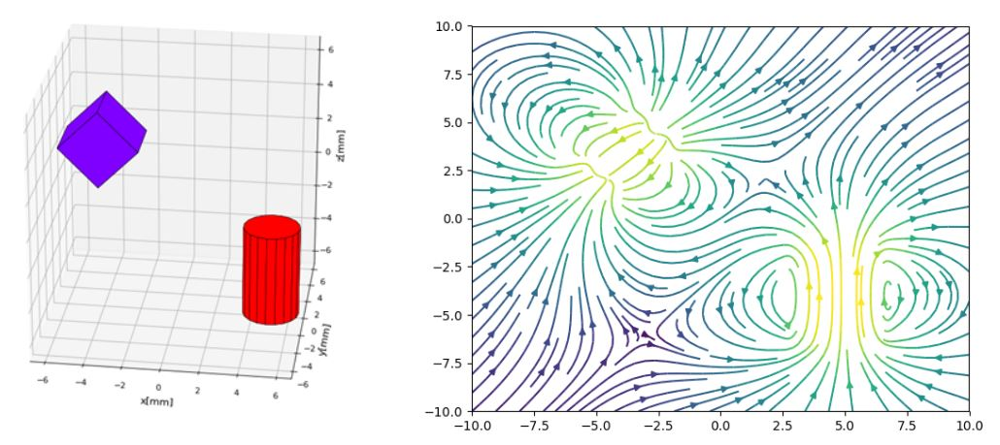

[](https://circleci.com/gh/OrtnerMichael/magPyLib) 
[](https://magpylib-magpylib.readthedocs-hosted.com/)

---

# About
*A simple and user friendly magnetic toolbox for Python 3.2+*

### What is Magpylib ?
 - Magpylib is a Python library for calculating magnetic fields from permanent magnets and current distributions. 
 - It provides an intuitive magnetic source class to quickly generate, group, geometrically manipulate and visualize assemblies of magnets and currents and the fields they generate.
 - The magnetic fields are determined from underlying (semi-) analytical solutions that are found in the literature.

### Why Magpylib ?
- Provide a fast and convenient tool to quickly calculate magnetic fields directly in a local Python work-environment for immediate analysis, test and manipulation.
- This is made possible by the fast computation times of the underlying analytical solutions which can be in the sub millisecond range and require no computation power as opposed to heavy numerical simulation like FEM.
- Practical tool for magnetic system design
    - Efficient for multivariate global optimization problems (for geometric shape variation).
    - Quick visualization of fields of complex assemblies (for finding a magnetic map concept).

---
### Dependencies: 
_Python3.2+_, _Numpy_, _Matplotlib_

### Installation:

- Create virtual environment:
```bash
$ conda create -n packCondaTest 
```
- Activate:

```bash
$ conda activate packCondaTest
```

- Install the generated library for the environment:


```bash
(packCondaTest) /magpylib$  pip install .
```

The library is now in the packCondaTest environment.


---
### Example:

- Two permanent magnets with axial magnetization are created and geometrically manipulated. They are grouped in a single collection and the system geometry is displayed using a supplied method.
- The total magnetic field that is generated by the collection is calculated on a grid in the xz-plane and is displayed using matplotlib.

**Program output:**


**Code:**
```python
# imports
import numpy as np
import matplotlib.pyplot as plt
import magpylib as magpy
 
# create magnets
magnet1 = magpy.source.magnet.Box(mag=[0,0,600],dim=[3,3,3],pos=[-4,0,3])
magnet2 = magpy.source.magnet.Cylinder(mag=[0,0,500], dim=[3,5], pos=[0,0,0])

# manipulate magnets
magnet1.rotate(45,[0,1,0],anchor=[0,0,0])
magnet2.move([5,0,-4])

# collect magnets
pmc = magpy.Collection(magnet1,magnet2)

# display system geometry
pmc.displaySystem()

# calculate B-fields on a grid
xs = np.linspace(-10,10,20)
zs = np.linspace(-10,10,20)
Bs = np.array([[pmc.getB([x,0,z]) for x in xs] for z in zs])

# display fields using matplotlib
fig, ax = plt.subplots()
X,Y = np.meshgrid(xs,zs)
U,V = Bs[:,:,0], Bs[:,:,2]
ax.streamplot(X, Y, U, V, color=np.log(U**2+V**2), density=1.5)
plt.show() 
```
