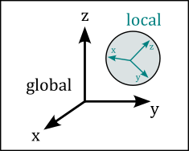
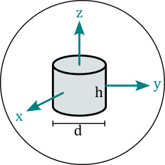
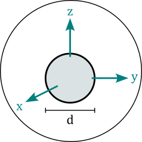
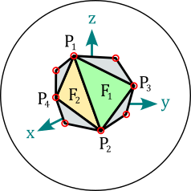
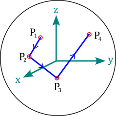
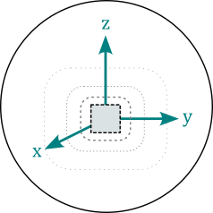
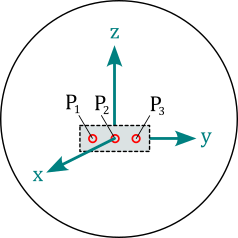

---
jupytext:
  text_representation:
    extension: .md
    format_name: myst
    format_version: 0.13
    jupytext_version: 1.14.5
kernelspec:
  display_name: Python 3
  language: python
  name: python3
---

(docu-classes)=

# The Magpylib Classes

In Magpylib's object oriented interface magnetic field **sources** (generate the field) and **observers** (read the field) are created as Python objects with various defining attributes and methods.

# Base properties

The following basic properties are shared by all Magpylib classes:

* The <span style="color: orange">**position**</span> and <span style="color: orange">**orientation**</span> attributes describe the object placement in the global coordinate system. By default `position=(0,0,0)` and `orientation=None` (=unit rotation).

* The <span style="color: orange">**move()**</span> and <span style="color: orange">**rotate()**</span> methods enable relative object positioning.

* The <span style="color: orange">**reset_path()**</span> method sets position and orientation to default values.

* The <span style="color: orange">**barycenter**</span> property returns the object barycenter (often the same as position).

See {ref}`docu-position` for more information on these features.


* The <span style="color: orange">**style**</span> attribute includes all settings for graphical object representation. 

* The <span style="color: orange">**show()**</span> method gives quick access to the graphical represenation.

See {ref}`docu-graphics` for more information on graphic output, default styles and customization possibilities.

* The <span style="color: orange">**getB()**</span> and <span style="color: orange">**getH()**</span> methods give quick access to field computation.

See {ref}`docu-field-computation` for more information.


* The <span style="color: orange">**parent**</span> attribute references a [Collection](docu-collection) that the object is part of.

* The <span style="color: orange">**copy()**</span> method can be used to create a clone of any object where selected properties, given by kwargs, are modified.

* The <span style="color: orange">**describe()**</span> method provides a brief description of the object and returns the unique object id.

## Local and global coordinates

::::{grid} 2
:::{grid-item}
:columns: 9
Magpylib objects span a local reference frame, and all object properties are defined within this frame, for example the vertices of a `Tetrahedron` magnet (see below). The position and orientation attributes describe how the local frame lies within the global coordinates. The two frames coincide by default, when `position=(0,0,0)` and `orientation=None` (=unit rotation).
:::
:::{grid-item}
:columns: 3

:::
::::

## I/O units and types

**Types:** Magpylib requires no special input format. All scalar types (`int`, `float`, ...) and vector types (`list`, `tuple`, `np.ndarray`, ... ) are accepted. Magpylib returns everything as `np.ndarray`.

**Units:** Magpylib is set up so that all input and output units are kA/m, mT, A, and mm.

---------------------------------------------


# Magnet classes

All magnets are sources. They have the <span style="color: orange">**magnetization**</span> attribute which is of the format $(m_x, m_y, m_z)$ and denotes a homogeneous magnetization/polarization vector in the local object coordinates in units of mT. Information how this is related to material properties from data sheets is found in the [Physics and Computation](phys-remanence) section.


## Cuboid
```python
magpy.magnet.Cuboid(magnetization, dimension, position, orientation, style)
```

::::{grid} 2
:::{grid-item}
:columns: 9
`Cuboid` objects represent magnets with cuboid shape. The <span style="color: orange">**dimension**</span> attribute has the format $(a,b,c)$ and denotes the sides of the cuboid in units of mm. The center of the cuboid lies in the origin of the local coordinates, and the sides are parallel to the coordinate axes.
:::
:::{grid-item}
:columns: 3

:::
::::


## Cylinder
```python
magpy.magnet.Cylinder(magnetization, dimension, position, orientation, style)
```

::::{grid} 2
:::{grid-item}
:columns: 9
`Cylinder` objects represent magnets with cylindrical shape. The <span style="color: orange">**dimension**</span> attribute has the format $(d,h)$ and denotes diameter and height of the cylinder in units of mm. The center of the cylinder lies in the origin of the local coordinates, and the cylinder axis coincides with the z-axis.
:::
:::{grid-item}
:columns: 3

:::
::::


## CylinderSegment
```python
magpy.magnet.CylinderSegment(magnetization, dimension, position, orientation, style)
```

::::{grid} 2
:::{grid-item}
:columns: 9
`CylinderSegment`represents a magnet with the shape of a cylindrical ring section. The <span style="color: orange">**dimension**</span> attribute has the format $(r_1,r_2,h,\varphi_1,\varphi_2)$ and denotes inner radius, outer radius and height in units of mm and the two section angles $\varphi_1<\varphi_2$ in deg. The center of the full cylinder lies in the origin of the local coordinates, and the cylinder axis coincides with the z-axis.
:::
:::{grid-item}
:columns: 3

:::
:::{grid-item}
:columns: 12
**Info:** When the cylinder section angles span 360°, then the much faster `Cylinder` methods are used for the field computation.
:::
::::


## Sphere
```python
magpy.magnet.Sphere(magnetization, diameter, position, orientation, style)
```

::::{grid} 2
:::{grid-item}
:columns: 9
`Sphere` represents a magnet of spherical shape. The <span style="color: orange">**diameter**</span> attribute is the sphere diameter $d$ in units of mm. The center of the sphere lies in the origin of the local coordinates.
:::
:::{grid-item}
:columns: 3

:::
::::


## Tetrahedron
```python
magpy.magnet.Tetrahedron(magnetization, vertices, position, orientation, style)
```

::::{grid} 2
:::{grid-item}
:columns: 9
`Tetrahedron` represents a magnet of tetrahedral shape. The <span style="color: orange">**vertices**</span> attribute stores the four corner points $(P_1, P_2, P_3, P_4)$ in units of mm in the local object coordinates.
:::
:::{grid-item}
:columns: 3

:::
:::{grid-item}
:columns: 12
**Info:** The `Tetrahedron` field is computed from four `Triangle` fields.
:::
::::


## TriangularMesh
```python
magpy.magnet.TriangularMesh(magnetization, vertices, faces, position, orientation, check_open, check_disconnected, check_selfintersecting, reorient_faces, style)
```

::::{grid} 2
:::{grid-item}
:columns: 9
`TriangularMesh` represents a magnet with surface given by a triangular mesh. The mesh is defined by the <span style="color: orange">**vertices**</span> attribute, an array of all unique corner points $(P_1, P_2, ...)$ in units of mm, and the <span style="color: orange">**faces**</span> attribute, which is an array of index-triplets that define individual faces $(F_1, F_2, ...)$. The property <span style="color: orange">**mesh**</span> returns an array of all faces as point-triples $[(P_1^1, P_2^1, P_3^1), (P_1^2, P_2^2, P_3^2), ...]$.

At initialization the mesh integrity is automatically checked, and all faces are reoriented to point outwards. These actions are controlled via the kwargs
* <span style="color: orange">**check_open**</span>
* <span style="color: orange">**check_disconnected**</span>
* <span style="color: orange">**check_selfintersecting**</span>
* <span style="color: orange">**reorient_faces**</span>

which are all by default set to `"warn"`. Options are `"skip"` (don't perform check), `"ignore"` (ignore if check fails), `"warn"` (warn if check fails), `"raise"` (raise error if check fails).

Results of the checks are stored in the following object attributes
* <span style="color: orange">**status_open**</span> can be `True`, `False` or `"unchecked"`
* <span style="color: orange">**status_open_data**</span> contatins an array of open edges
* <span style="color: orange">**status_disconnected**</span> can be `True`, `False` or `"unchecked"`
* <span style="color: orange">**status_disconnected_data**</span> contains an array of mesh parts
* <span style="color: orange">**status_selfintersecting**</span> can be `True`, `False` or `"unchecked"`
* <span style="color: orange">**status_selfintersecting_data**</span> contains an array of self-intersecting faces
* <span style="color: orange">**status_reoriented**</span> can be `True` or `False`

The checks can also be performed after initialization using the methods
* <span style="color: orange">**check_open()**</span>
* <span style="color: orange">**check_disconnected()**</span>
* <span style="color: orange">**check_selfintersecting()**</span>
* <span style="color: orange">**reorient_faces()**</span>

The following class methods enable easy mesh loading and creating. They all take the mandatory <span style="color: orange">**magnetization**</span> argument, which overwrites possible magnetization from other inputs, as well as the optional mesh check parameters (see above).

* <span style="color: orange">**TriangularMesh.from_mesh()**</span> requires the input <span style="color: orange">**mesh**</span>, which is an array in the mesh format $[(P_1^1, P_2^1, P_3^1), (P_1^2, P_2^2, P_3^2), ...]$.
* <span style="color: orange">**TriangularMesh.from_ConvexHull()**</span> requires the input <span style="color: orange">**points**</span>, which is an array of positions $(P_1, P_2, P_3, ...)$ from which the convex Hull is computed via the [Scipy ConvexHull](https://docs.scipy.org/doc/scipy/reference/generated/scipy.spatial.ConvexHull.html) implementation.
* <span style="color: orange">**TriangularMesh.from_triangles()**</span> requires the input <span style="color: orange">**triangles**</span>, which is a list or a `Collection` of `Triangle` objects.
* <span style="color: orange">**TriangularMesh.from_pyvista()**</span> requires the input <span style="color: orange">**polydata**</span>, which is a [Pyvista PolyData](https://docs.pyvista.org/version/stable/api/core/_autosummary/pyvista.PolyData.html) object.

The method <span style="color: orange">**to_TriangleCollection()**</span> transforms a `TriangularMesh` object into a `Collection` of `Triangle` objects.
:::
:::{grid-item}
:columns: 3

:::
:::{grid-item}
:columns: 12
**Info:** While the checks may be disabled, the field computation garantees correct results only if the mesh is closed, connected, not self-intersecting and all faces are oriented outwards. A tutorial {ref}`galler-tutorial-trimesh` is provided in the gallery.
:::
::::


---------------------------------------------


# Current classes

All currents are sources. Current objects have the <span style="color: orange">**current**</span> attribute which is a scalar that denotes the electrical current in units of A.

## Loop
```python
magpy.current.Loop(current, diameter, position, orientation, style)
```

::::{grid} 2
:::{grid-item}
:columns: 9
`Current` represents a circular line current loop. The <span style="color: orange">**diameter**</span> attribute is the loop diameter $d$ in units of mm. The loop lies in the xy-plane with it's center in the origin of the local coordinates.
:::
:::{grid-item}
:columns: 3

:::
::::

## Line
```python
magpy.current.Line(current, vertices, position, orientation, style)
```

::::{grid} 2
:::{grid-item}
:columns: 9
`Line` represents a set of line current segments that flow from vertex to vertex. The <span style="color: orange">**vertices**</span> attribute is a vector of all vertices $(P_1, P_2, ...)$ given in units of mm in the local coordinates.
:::
:::{grid-item}
:columns: 3

:::
::::

---------------------------------------------

# Miscellanous classes

There are classes listed hereon that function as sources, but they do not represent physical magnets or current distributions.


## Dipole
```python
magpy.misc.Dipole(moment, position, orientation, style)
```

::::{grid} 2
:::{grid-item}
:columns: 9
`Dipole` represents a magnetic dipole moment with the <span style="color: orange">**moment**</span> attribute that describes the magnetic dipole moment $m=(m_x,m_y,m_z)$ in units of mT mm³ which lies in the origin of the local coordinates.
:::
:::{grid-item}
:columns: 3

:::
:::{grid-item}
:columns: 12
**Info:** For homogeneous magnets the relation moment=magnetization$\times$volume holds. 
:::
::::


## Triangle
```python
magpy.misc.Triangle(magnetization, vertices, position, orientation, style)
```

::::{grid} 2
:::{grid-item}
:columns: 9
`Triangle` represents a triangular surface with a homogeneous charge density given by the projection of the magnetization vector onto the surface normal. The <span style="color: orange">**magnetization**</span> attribute stores the magnetization vector $(m_x,m_y,m_z)$ in units of mT. The <span style="color: orange">**vertices**</span> attribute is a set of the three triangle corners $(P_1, P_2, P_3)$ given in units of mm³ in the local coordinates.
:::
:::{grid-item}
:columns: 3

:::
:::{grid-item}
:columns: 12
**Info:** When multiple Triangles with similar magnetization vectors form a closed surface, and all their orientations (right-hand-rule) point outwards, their total H-field is equivalent to the field of a homogeneous magnet of the same shape. The B-field is only correct on the outside of the body. On the inside the magnetization must be added to the field. This is demonstrated in the tutorial {ref}`gallery-ext-complex-shapes-triangle`.
:::
::::


## CustomSource
```python
magpy.misc.CustomSource(field_func, position, orientation, style)
```

::::{grid} 2
:::{grid-item}
:columns: 9
`CustomSource` is used to create user defined sources with their own field functions. The argument <span style="color: orange">**field_func**</span> takes a function that is then automatically called for the field computation. This custom field function is treated like a [core function](docu-field-comp-core). It must have the positional arguments `field` with values `"B"` or `"H"`, and `observers` (must accept array_like, shape (n,3)) and return the B-field in units of mT and the H-field in units of kA/m with a similar shape.
:::
:::{grid-item}
:columns: 3

:::
:::{grid-item}
:columns: 12
**Info:** A tutorial {ref}`gallery-tutorial-custom` is found in the gallery.
:::
::::


---------------------------------------------


# Sensor
```python
magpy.Sensor(position, pixel, orientation, style)
```

::::{grid} 2
:::{grid-item}
:columns: 9
`Sensor` represents a 3D magnetic field sensor and can be used as Magpylib `observers` input. The <span style="color: orange">**pixel**</span> attribute is an array of positions $(P_1, P_2, ...)$ in the local sensor coordinates where the field is computed. By default `pixel=(0,0,0)` and the sensor simply returns the field at it's position.
:::
:::{grid-item}
:columns: 3

:::
:::{grid-item}
:columns: 12
**Info:** With sensors it is possible to give observers their own position and orientation. The field is always computed in the reference frame of the sensor, which might itself be moving in the global coordinate system. A tutorial {ref}`gallery-tutorial-sensors` is provided in the gallery.
:::
::::


---------------------------------------------


(docu-collection)=

# Collection
```python
magpy.Collection(*children, position, orientation, style)
```

::::{grid} 2
:::{grid-item}
:columns: 9
A `Collection` is a group of Magpylib objects that is used for common manipulation. All these objects are stored by reference in the <span style="color: orange">**children**</span> attribute. There are several options for accessing only specific children via the following properties

* <span style="color: orange">**sources**</span>: return only sources
* <span style="color: orange">**observers**</span>: return only observers
* <span style="color: orange">**collections**</span>: return only collections
* <span style="color: orange">**sources_all**</span>: return all sources, including the ones from sub-collections
* <span style="color: orange">**observers_all**</span>: return all observers, including the ones from sub-collections
* <span style="color: orange">**collections_all**</span>: return all collections, including the ones from sub-collections

Additional methods for adding and removing children:

- <span style="color: orange">**add()**</span>: Add an object to the collection
- <span style="color: orange">**remove()**</span>: Remove an object from the collection
:::
:::{grid-item}
:columns: 3

:::
:::{grid-item}
:columns: 12
**Info:** A collection object has its own `position` and `orientation` attributes and spans a local reference frame for all its children. An operation applied to a collection moves the frame, and is individually applied to all children such that their relative position in the local reference frame is maintained. This means that the collection functions  as a container for manipulation, but child position and orientation are always updated in the global coordinate system. After being added to a collection, it is still possible to manipulate the individual children, which will also move them to a new relative position in the collection frame.

Collections have **format** as an additional argument for **describe()** method. Default value is `format="type+id+label"`. Any combination of `"type"`, `"id"`, and `"label"` is allowed.

A tutorial {ref}`gallery-tutorial-collection` is provided in the example gallery.
:::
::::
