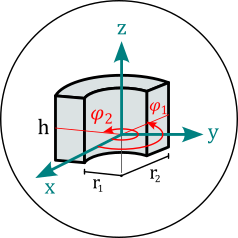
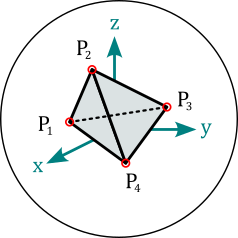
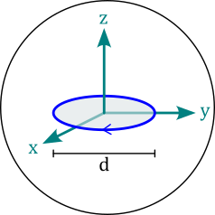
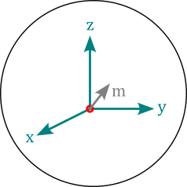
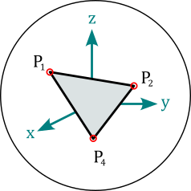
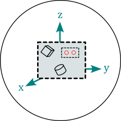

(docu-magpylib)=

<hr style="border:3px solid gray">

(docu-io)=

# I/O

## Types

Magpylib requires no special input format. All scalar types (`int`, `float`, ...) and vector types (`list`, `tuple`, `np.ndarray`, ... ) are accepted. Magpylib returns everything as `np.ndarray`.

## Units

Length inputs can have arbitrary dimension due to the scaling property - _"a magnet with 1 mm sides creates the same field at 1 mm distance as a magnet with 1 m sides at 1 m distance"_.

Magnetic field outputs are directly proportional to `magnetization`, `current`, and dipole `moment` inputs. For example, when the `magnetization` input unit is T (or mT), then the `getB` output unit is also T (or mT). The following table shows how input and putput units are connected.

::::{grid} 3
:::{grid-item}
:columns: 2
:::

:::{grid-item}
:columns: 8
| INPUT | B - FIELD | H - FIELD  |
|:---:|:---:|:---:|
| `magnetization` in **mT**      | **mT**    | **kA/m**   |
| `current` in **A**             | **mT**    | **kA/m**   |
| dipole `moment` in **mT*mm^3** | **mT**    | **kA/m**   |
:::

:::{grid-item}
:columns: 2
:::
::::

Be careful that you do not mix units up when working with different source types.


<!-- ################################################################## -->
<!-- ################################################################## -->
<!-- ################################################################## -->

<br/><br/>
<hr style="border:3px solid gray">

(docu-classes)=

# The Magpylib Classes

In Magpylib's object oriented interface magnetic field **sources** (generate the field) and **observers** (read the field) are created as Python objects with various defining attributes and methods.

## Base properties

The following basic properties are shared by all Magpylib classes:

* The <span style="color: orange">**position**</span> and <span style="color: orange">**orientation**</span> attributes describe the object placement in the global coordinate system. By default `position=(0,0,0)` and `orientation=None` (=unit rotation).

* The <span style="color: orange">**move()**</span> and <span style="color: orange">**rotate()**</span> methods enable relative object positioning.

* The <span style="color: orange">**reset_path()**</span> method sets position and orientation to default values.

* The <span style="color: orange">**barycenter**</span> property returns the object barycenter (often the same as position).

See {ref}`docu-position` for more information on these features.


* The <span style="color: orange">**style**</span> attribute includes all settings for graphical object representation. 

* The <span style="color: orange">**show()**</span> method gives quick access to the graphical represenation.

See {ref}`docu-graphics` for more information on graphic output, default styles and customization possibilities.

* The <span style="color: orange">**getB()**</span> and <span style="color: orange">**getH()**</span> methods give quick access to field computation.

See {ref}`docu-field-computation` for more information.


* The <span style="color: orange">**parent**</span> attribute references a [Collection](docu-collection) that the object is part of.

* The <span style="color: orange">**copy()**</span> method can be used to create a clone of any object where selected properties, given by kwargs, are modified.

* The <span style="color: orange">**describe()**</span> method provides a brief description of the object and returns the unique object id.

## Local and global coordinates

::::{grid} 2
:::{grid-item}
:columns: 9
Magpylib objects span a local reference frame, and all object properties are defined within this frame, for example the vertices of a `Tetrahedron` magnet (see below). The position and orientation attributes describe how the local frame lies within the global coordinates. The two frames coincide by default, when `position=(0,0,0)` and `orientation=None` (=unit rotation).
:::
:::{grid-item}
:columns: 3

:::
::::


---------------------------------------------


## Magnet classes

All magnets are sources. They have the <span style="color: orange">**magnetization**</span> attribute which is of the format $(m_x, m_y, m_z)$ and denotes a homogeneous magnetization/polarization vector in the local object coordinates. Information how this is related to material properties from data sheets is found in the [Physics and Computation](phys-remanence) section.


### Cuboid
```python
magpy.magnet.Cuboid(magnetization, dimension, position, orientation, style)
```

::::{grid} 2
:::{grid-item}
:columns: 9
`Cuboid` objects represent magnets with cuboid shape. The <span style="color: orange">**dimension**</span> attribute has the format $(a,b,c)$ and denotes the sides of the cuboid. The center of the cuboid lies in the origin of the local coordinates, and the sides are parallel to the coordinate axes.
:::
:::{grid-item}
:columns: 3

:::
::::


### Cylinder
```python
magpy.magnet.Cylinder(magnetization, dimension, position, orientation, style)
```

::::{grid} 2
:::{grid-item}
:columns: 9
`Cylinder` objects represent magnets with cylindrical shape. The <span style="color: orange">**dimension**</span> attribute has the format $(d,h)$ and denotes diameter and height of the cylinder. The center of the cylinder lies in the origin of the local coordinates, and the cylinder axis coincides with the z-axis.
:::
:::{grid-item}
:columns: 3

:::
::::


### CylinderSegment
```python
magpy.magnet.CylinderSegment(magnetization, dimension, position, orientation, style)
```

::::{grid} 2
:::{grid-item}
:columns: 9
`CylinderSegment`represents a magnet with the shape of a cylindrical ring section. The <span style="color: orange">**dimension**</span> attribute has the format $(r_1,r_2,h,\varphi_1,\varphi_2)$ and denotes inner radius, outer radius and height and the two section angles $\varphi_1<\varphi_2$ in deg. The center of the full cylinder lies in the origin of the local coordinates, and the cylinder axis coincides with the z-axis.
:::
:::{grid-item}
:columns: 3

:::
:::{grid-item}
:columns: 12
**Info:** When the cylinder section angles span 360°, then the much faster `Cylinder` methods are used for the field computation.
:::
::::


### Sphere
```python
magpy.magnet.Sphere(magnetization, diameter, position, orientation, style)
```

::::{grid} 2
:::{grid-item}
:columns: 9
`Sphere` represents a magnet of spherical shape. The <span style="color: orange">**diameter**</span> attribute is the sphere diameter $d$. The center of the sphere lies in the origin of the local coordinates.
:::
:::{grid-item}
:columns: 3

:::
::::


### Tetrahedron
```python
magpy.magnet.Tetrahedron(magnetization, vertices, position, orientation, style)
```

::::{grid} 2
:::{grid-item}
:columns: 9
`Tetrahedron` represents a magnet of tetrahedral shape. The <span style="color: orange">**vertices**</span> attribute stores the four corner points $(P_1, P_2, P_3, P_4)$ in the local object coordinates.
:::
:::{grid-item}
:columns: 3

:::
:::{grid-item}
:columns: 12
**Info:** The `Tetrahedron` field is computed from four `Triangle` fields.
:::
::::


### TriangularMesh
```python
magpy.magnet.TriangularMesh(magnetization, vertices, faces, position, orientation, check_open, check_disconnected, check_selfintersecting, reorient_faces, style)
```

::::{grid} 2
:::{grid-item}
:columns: 9
`TriangularMesh` represents a magnet with surface given by a triangular mesh. The mesh is defined by the <span style="color: orange">**vertices**</span> attribute, an array of all unique corner points $(P_1, P_2, ...)$, and the <span style="color: orange">**faces**</span> attribute, which is an array of index-triplets that define individual faces $(F_1, F_2, ...)$. The property <span style="color: orange">**mesh**</span> returns an array of all faces as point-triples $[(P_1^1, P_2^1, P_3^1), (P_1^2, P_2^2, P_3^2), ...]$.

At initialization the mesh integrity is automatically checked, and all faces are reoriented to point outwards. These actions are controlled via the kwargs
* <span style="color: orange">**check_open**</span>
* <span style="color: orange">**check_disconnected**</span>
* <span style="color: orange">**check_selfintersecting**</span>
* <span style="color: orange">**reorient_faces**</span>

which are all by default set to `"warn"`. Options are `"skip"` (don't perform check), `"ignore"` (ignore if check fails), `"warn"` (warn if check fails), `"raise"` (raise error if check fails).

Results of the checks are stored in the following object attributes
* <span style="color: orange">**status_open**</span> can be `True`, `False` or `None` (unchecked)
* <span style="color: orange">**status_open_data**</span> contatins an array of open edges
* <span style="color: orange">**status_disconnected**</span> can be `True`, `False` or `None` (unchecked)
* <span style="color: orange">**status_disconnected_data**</span> contains an array of mesh parts
* <span style="color: orange">**status_selfintersecting**</span> can be `True`, `None` or `None` (unchecked)
* <span style="color: orange">**status_selfintersecting_data**</span> contains an array of self-intersecting faces
* <span style="color: orange">**status_reoriented**</span> can be `True` or `False`

The checks can also be performed after initialization using the methods
* <span style="color: orange">**check_open()**</span>
* <span style="color: orange">**check_disconnected()**</span>
* <span style="color: orange">**check_selfintersecting()**</span>
* <span style="color: orange">**reorient_faces()**</span>

The following class methods enable easy mesh loading and creating. They all take the mandatory <span style="color: orange">**magnetization**</span> argument, which overwrites possible magnetization from other inputs, as well as the optional mesh check parameters (see above).

* <span style="color: orange">**TriangularMesh.from_mesh()**</span> requires the input <span style="color: orange">**mesh**</span>, which is an array in the mesh format $[(P_1^1, P_2^1, P_3^1), (P_1^2, P_2^2, P_3^2), ...]$.
* <span style="color: orange">**TriangularMesh.from_ConvexHull()**</span> requires the input <span style="color: orange">**points**</span>, which is an array of positions $(P_1, P_2, P_3, ...)$ from which the convex Hull is computed via the [Scipy ConvexHull](https://docs.scipy.org/doc/scipy/reference/generated/scipy.spatial.ConvexHull.html) implementation.
* <span style="color: orange">**TriangularMesh.from_triangles()**</span> requires the input <span style="color: orange">**triangles**</span>, which is a list or a `Collection` of `Triangle` objects.
* <span style="color: orange">**TriangularMesh.from_pyvista()**</span> requires the input <span style="color: orange">**polydata**</span>, which is a [Pyvista PolyData](https://docs.pyvista.org/version/stable/api/core/_autosummary/pyvista.PolyData.html) object.

The method <span style="color: orange">**to_TriangleCollection()**</span> transforms a `TriangularMesh` object into a `Collection` of `Triangle` objects.
:::
:::{grid-item}
:columns: 3

:::
:::{grid-item}
:columns: 12
**Info:** While the checks may be disabled, the field computation garantees correct results only if the mesh is closed, connected, not self-intersecting and all faces are oriented outwards. A tutorial {ref}`galler-tutorial-trimesh` is provided in the gallery.
:::
::::


---------------------------------------------


## Current classes

All currents are sources. Current objects have the <span style="color: orange">**current**</span> attribute which is a scalar that denotes the electrical current.

### Loop
```python
magpy.current.Loop(current, diameter, position, orientation, style)
```

::::{grid} 2
:::{grid-item}
:columns: 9
`Current` represents a circular line current loop. The <span style="color: orange">**diameter**</span> attribute is the loop diameter $d$. The loop lies in the xy-plane with it's center in the origin of the local coordinates.
:::
:::{grid-item}
:columns: 3

:::
::::

### Line
```python
magpy.current.Line(current, vertices, position, orientation, style)
```

::::{grid} 2
:::{grid-item}
:columns: 9
`Line` represents a set of line current segments that flow from vertex to vertex. The <span style="color: orange">**vertices**</span> attribute is a vector of all vertices $(P_1, P_2, ...)$ given in the local coordinates.
:::
:::{grid-item}
:columns: 3

:::
::::

---------------------------------------------

## Miscellanous classes

There are classes listed hereon that function as sources, but they do not represent physical magnets or current distributions.


### Dipole
```python
magpy.misc.Dipole(moment, position, orientation, style)
```

::::{grid} 2
:::{grid-item}
:columns: 9
`Dipole` represents a magnetic dipole moment with the <span style="color: orange">**moment**</span> attribute that describes the magnetic dipole moment $m=(m_x,m_y,m_z)$ which lies in the origin of the local coordinates.
:::
:::{grid-item}
:columns: 3

:::
:::{grid-item}
:columns: 12
**Info:** For homogeneous magnets the relation moment=magnetization$\times$volume holds. 
:::
::::


### Triangle
```python
magpy.misc.Triangle(magnetization, vertices, position, orientation, style)
```

::::{grid} 2
:::{grid-item}
:columns: 9
`Triangle` represents a triangular surface with a homogeneous charge density given by the projection of the magnetization vector onto the surface normal. The <span style="color: orange">**magnetization**</span> attribute stores the magnetization vector $(m_x,m_y,m_z)$. The <span style="color: orange">**vertices**</span> attribute is a set of the three triangle corners $(P_1, P_2, P_3)$ in the local coordinates.
:::
:::{grid-item}
:columns: 3

:::
:::{grid-item}
:columns: 12
**Info:** When multiple Triangles with similar magnetization vectors form a closed surface, and all their orientations (right-hand-rule) point outwards, their total H-field is equivalent to the field of a homogeneous magnet of the same shape. The B-field is only correct on the outside of the body. On the inside the magnetization must be added to the field. This is demonstrated in the tutorial {ref}`gallery-ext-complex-shapes-triangle`.
:::
::::


### CustomSource
```python
magpy.misc.CustomSource(field_func, position, orientation, style)
```

::::{grid} 2
:::{grid-item}
:columns: 9
`CustomSource` is used to create user defined sources with their own field functions. The argument <span style="color: orange">**field_func**</span> takes a function that is then automatically called for the field computation. This custom field function is treated like a [core function](docu-field-comp-core). It must have the positional arguments `field` with values `"B"` or `"H"`, and `observers` (must accept array_like, shape (n,3)) and return the B-field and the H-field with a similar shape.
:::
:::{grid-item}
:columns: 3

:::
:::{grid-item}
:columns: 12
**Info:** A tutorial {ref}`gallery-tutorial-custom` is found in the gallery.
:::
::::


---------------------------------------------


## Sensor
```python
magpy.Sensor(position, pixel, orientation, style)
```

::::{grid} 2
:::{grid-item}
:columns: 9
`Sensor` represents a 3D magnetic field sensor and can be used as Magpylib `observers` input. The <span style="color: orange">**pixel**</span> attribute is an array of positions $(P_1, P_2, ...)$ in the local sensor coordinates where the field is computed. By default `pixel=(0,0,0)` and the sensor simply returns the field at it's position.
:::
:::{grid-item}
:columns: 3

:::
:::{grid-item}
:columns: 12
**Info:** With sensors it is possible to give observers their own position and orientation. The field is always computed in the reference frame of the sensor, which might itself be moving in the global coordinate system. A tutorial {ref}`gallery-tutorial-sensors` is provided in the gallery.
:::
::::


---------------------------------------------


(docu-collection)=

## Collection
```python
magpy.Collection(*children, position, orientation, style)
```

::::{grid} 2
:::{grid-item}
:columns: 9
A `Collection` is a group of Magpylib objects that is used for common manipulation. All these objects are stored by reference in the <span style="color: orange">**children**</span> attribute. There are several options for accessing only specific children via the following properties

* <span style="color: orange">**sources**</span>: return only sources
* <span style="color: orange">**observers**</span>: return only observers
* <span style="color: orange">**collections**</span>: return only collections
* <span style="color: orange">**sources_all**</span>: return all sources, including the ones from sub-collections
* <span style="color: orange">**observers_all**</span>: return all observers, including the ones from sub-collections
* <span style="color: orange">**collections_all**</span>: return all collections, including the ones from sub-collections

Additional methods for adding and removing children:

- <span style="color: orange">**add()**</span>: Add an object to the collection
- <span style="color: orange">**remove()**</span>: Remove an object from the collection
:::
:::{grid-item}
:columns: 3

:::
:::{grid-item}
:columns: 12
**Info:** A collection object has its own `position` and `orientation` attributes and spans a local reference frame for all its children. An operation applied to a collection moves the frame, and is individually applied to all children such that their relative position in the local reference frame is maintained. This means that the collection functions  as a container for manipulation, but child position and orientation are always updated in the global coordinate system. After being added to a collection, it is still possible to manipulate the individual children, which will also move them to a new relative position in the collection frame.

Collections have **format** as an additional argument for **describe()** method. Default value is `format="type+id+label"`. Any combination of `"type"`, `"id"`, and `"label"` is allowed.

A tutorial {ref}`gallery-tutorial-collection` is provided in the example gallery.
:::
::::


<!-- ################################################################## -->
<!-- ################################################################## -->
<!-- ################################################################## -->


<br/><br/>
<hr style="border:3px solid gray">

(docu-position)=

# Position, Orientation, and Paths


::::{grid} 2

:::{grid-item}
:columns: 7
The explicit magnetic field expressions, implemented in Magpylib, are generally described in convenient coordinates of the sources. It is a common problem to transform the field into an application relevant lab coordinate system. While not technically difficult, such transformations are prone to error.

Here Magpylib helps out. All Magpylib objects lie in a global Cartesian coordinate system. Object position and orientation are defined by the attributes `position` and `orientation`, 😏. Objects can easily be moved around using the `move()` and `rotate()` methods. Eventually, the field is computed in the reference frame of the observers.
:::
:::{grid-item}
:columns: 5

:::
::::

Position and orientation of all Magpylib objects are defind by the two attributes

::::{grid} 2
:::{grid-item-card}
:shadow: none
:columns: 5
<span style="color: orange">**position**</span> - a point $(x,y,z)$ in the global coordinates, or a set of such points $(P_1, P_2, ...)$. By default objects are created with `position=(0,0,0)`.
:::
:::{grid-item-card}
:shadow: none
:columns: 7
<span style="color: orange">**orientation**</span> - a [Scipy Rotation object](https://docs.scipy.org/doc/scipy/reference/generated/scipy.spatial.transform.Rotation.html) which describes the object rotation relative to its default orientation (defined in {ref}`docu-classes`). By default, objects are created with unit rotation `orientation=None`.
:::
::::

The position and orientation attributes can be either **scalar**, i.e. a single position or a single rotation, or **vector**, when they are arrays of such scalars. The two attributes together define the **path** of an object - Magpylib makes sure that they are always of the same length. When the field is computed, it is automatically computed for the whole path.

```{tip}
To enable vectorized field computation, paths should always be used when modeling multiple object positions. Avoid using Python loops at all costs for that purpose! If your path is difficult to realize, consider using the [direct interface](docu-direct-interface) instead.
```

Magpylib offers two powerful methods for object manipulation:

::::{grid} 2
:::{grid-item-card}
:columns: 5
:shadow: none
<span style="color: orange">**move(**</span>`displacement`, `start="auto"`<span style="color: orange">**)**</span> -  move object by `displacment` input. `displacement` is a position vector (scalar input) or a set of position vectors (vector input).
:::
:::{grid-item-card}
:columns: 7
:shadow: none
<span style="color: orange">**rotate(**</span>`rotation`, `anchor=None`, `start="auto"`<span style="color: orange">**)**</span> - rotates the object by the `rotation` input about an anchor point defined by the `anchor` input. `rotation` is a [Scipy Rotation object](https://docs.scipy.org/doc/scipy/reference/generated/scipy.spatial.transform.Rotation.html), and `anchor` is a position vector. Both can be scalar or vector inputs. With `anchor=None` the object is rotated about its `position`.
:::
::::

- Scalar input is applied to the whole object path, starting with path index `start`. With the default `start="auto"` the index is set to `start=0` and the functionality is **moving objects around**.
- Vector input of length $n$ applies the $n$ individual operations to $n$ object path entries, starting with path index `start`. Padding applies when the input exceeds the existing path. With the default `start="auto"` the index is set to `start=len(object path)` and the functionality is **appending paths**.

The practical application of this formalism is best demonstrated by the following program

```python
import magpylib as magpy

sensor = magpy.Sensor()
print(sensor.position)                                    # default value
#   --> [0. 0. 0.]

sensor.move((1,1,1))                                      # scalar input is by default applied
print(sensor.position)                                    # to the whole path
#   --> [1. 1. 1.]

sensor.move([(1,1,1), (2,2,2)])                           # vector input is by default appended
print(sensor.position)                                    # to the existing path
#   --> [[1. 1. 1.]  [2. 2. 2.]  [3. 3. 3.]]

sensor.move((1,1,1), start=1)                             # scalar input and start=1 is applied
print(sensor.position)                                    # to whole path starting at index 1
#   --> [[1. 1. 1.]  [3. 3. 3.]  [4. 4. 4.]]

sensor.move([(0,0,10), (0,0,20)], start=1)                # vector input and start=1 merges
print(sensor.position)                                    # the input with the existing path
#   --> [[ 1.  1.  1.]  [ 3.  3. 13.]  [ 4.  4. 24.]]     # starting at index 1.
```

Several extensions of the `rotate` method give a lot of flexibility with object rotation:

:::{dropdown} <span style="color: orange">**rotate_from_angax(**</span>`angle`, `axis`, `anchor=None`, `start="auto"`, `degrees=True` <span style="color: orange">**)**</span>
`angle`: scalar or array_like with shape (n,)
    Angle(s) of rotation in units of deg (by default).

`axis`: str or array_like, shape (3,)
    The direction of the axis of rotation. Input can be a vector of shape (3,) or a string 'x', 'y' or 'z' to denote respective directions.

`anchor`: None, 0 or array_like with shape (3,) or (n,3), default=None
    The axis of rotation passes through the anchor point given in units of mm. By default (anchor=None) the object will rotate about its own center. anchor=0 rotates the object about the origin (0,0,0).

`start`: int or str, default='auto'
    Starting index when applying operations. See 'General move/rotate behavior' above for details.

`degrees`: bool, default=True
    Interpret input in units of deg or rad.
:::

:::{dropdown} <span style="color: orange">**rotate_from_rotvec(**</span>`rotvec`, `anchor=None`, `start="auto"`, `degrees=True` <span style="color: orange">**)**</span>
`rotvec` : array_like, shape (n,3) or (3,)
    Rotation input. Rotation vector direction is the rotation axis, vector length is the rotation angle in units of rad.

`anchor`: None, 0 or array_like with shape (3,) or (n,3), default=None
    The axis of rotation passes through the anchor point given in units of mm. By default (anchor=None) the object will rotate about its own center. anchor=0 rotates the object about the origin (0,0,0).

`start`: int or str, default='auto'
    Starting index when applying operations. See 'General move/rotate behavior' above for details.

`degrees`: bool, default=True
    Interpret input in units of deg or rad.
:::

:::{dropdown} <span style="color: orange">**rotate_from_euler(**</span> `angle`, `seq`, `anchor=None`, `start="auto"`, `degrees=True` <span style="color: orange">**)**</span>
angle: int, float or array_like with shape (n,)
    Angle(s) of rotation in units of deg (by default).
`seq` : string
    Specifies sequence of axes for rotations. Up to 3 characters belonging to the set {'X', 'Y', 'Z'} for intrinsic rotations, or {'x', 'y', 'z'} for extrinsic rotations. Extrinsic and intrinsic rotations cannot be mixed in one function call.

`anchor`: None, 0 or array_like with shape (3,) or (n,3), default=None
    The axis of rotation passes through the anchor point given in units of mm. By default (anchor=None) the object will rotate about its own center. anchor=0 rotates the object about the origin (0,0,0).

`start`: int or str, default='auto'
    Starting index when applying operations. See 'General move/rotate behavior' above for details.

`degrees`: bool, default=True
    Interpret input in units of deg or rad.
:::

:::{dropdown} <span style="color: orange">**rotate_from_quat(**</span>`quat`, `anchor=None`, `start="auto"` <span style="color: orange">**)**</span>
`quat` : array_like, shape (n,4) or (4,)
    Rotation input in quaternion form.

`anchor`: `None`, `0` or array_like with shape (3,) or (n,3), default=`None`
    The axis of rotation passes through the anchor point given in units of mm.
    By default (`anchor=None`) the object will rotate about its own center.
    `anchor=0` rotates the object about the origin `(0,0,0)`.

`start`: int or str, default=`'auto'`
    Starting index when applying operations. See 'General move/rotate behavior' above
    for details.
:::

:::{dropdown} <span style="color: orange">**rotate_from_mrp(**</span>`matrix`, `anchor=None`, `start="auto"` <span style="color: orange">**)**</span>
`matrix` : array_like, shape (n,3,3) or (3,3)
    Rotation input. See scipy.spatial.transform.Rotation for details.

`anchor`: `None`, `0` or array_like with shape (3,) or (n,3), default=`None`
    The axis of rotation passes through the anchor point given in units of mm.
    By default (`anchor=None`) the object will rotate about its own center.
    `anchor=0` rotates the object about the origin `(0,0,0)`.

`start`: int or str, default=`'auto'`
    Starting index when applying operations. See 'General move/rotate behavior' above
    for details.
:::

:::{dropdown} <span style="color: orange">**rotate_from_mrp(**</span>`mrp`, `anchor=None`, `start="auto"` <span style="color: orange">**)**</span>
`mrp` : array_like, shape (n,3) or (3,)
    Rotation input. See scipy Rotation package for details on Modified Rodrigues
    Parameters (MRPs).

`anchor`: `None`, `0` or array_like with shape (3,) or (n,3), default=`None`
    The axis of rotation passes through the anchor point given in units of mm.
    By default (`anchor=None`) the object will rotate about its own center.
    `anchor=0` rotates the object about the origin `(0,0,0)`.

`start`: int or str, default=`'auto'`
    Starting index when applying operations. See 'General move/rotate behavior' above
    for details.
:::

When objects with different path lengths are combined, e.g. when computing the field, the shorter paths are treated as static beyond their end to make the computation sensible. Internally, Magpylib follows a philosophy of edge-padding and end-slicing when adjusting paths.

::::{grid} 2
:::{grid-item-card}
:columns: 7
:shadow: none
**Edge-padding:** whenever path entries beyond the existing path length are needed the edge-entries of the existing path are returned. This means that the object is considered to be “static” beyond its existing path.
:::
:::{grid-item-card}
:columns: 5
:shadow: none
**End-slicing:** whenever a path is automatically reduced in length, Magpylib will slice such that the ending of the path is kept.
:::
::::

The tutorial {ref}`gallery-tutorial-paths` shows intuative good practice examples of the important functionality described in this section.


<!-- ################################################################## -->
<!-- ################################################################## -->
<!-- ################################################################## -->


<br/><br/>
<hr style="border:3px solid gray">

(docu-direct-interface)=
(docu-field-comp-core)=
(docu-field-computation)=
# Field Computation

Magnetic field computation is the central functionality of Magpylib. It evolves about the two functions

::::{grid}
:gutter: 2

:::{grid-item}
:columns: 1
:::

:::{grid-item-card}
:shadow: none
:columns: 10
<span style="color: orange">**getB(**</span>`sources`, `observers`, `squeeze=True`, `pixel_agg=None`, `output="ndarray"`<span style="color: orange">**)**</span>
:::

:::{grid-item}
:columns: 1
:::

:::{grid-item}
:columns: 1
:::

:::{grid-item-card}
:shadow: none
:columns: 10
<span style="color: orange">**getH(**</span>`sources`, `observers`, `squeeze=True`, `pixel_agg=None`, `output="ndarray"`<span style="color: orange">**)**</span> computes the H-field seen by `observers` generated by `sources`.
:::

:::{grid-item}
:columns: 1
:::

::::

which compute the magnetic field seen by `observers` in their local coordinates generated by `sources`.

The argument `observers` can be an array_like of position vectors with shape $(n_1,n_2,n_3,...,3)$, any Magpylib **observer object** or a flat list thereof.

The output of a field computation `getB(sources, observers)` is a Numpy ndarray (alternatively a Pandas DataFrame, see below) of shape `(l, m, k, n1, n2, n3, ..., 3)` where `l` is the number of input sources, `m` the (maximal) object path length, `k` the number of sensors, `n1,n2,n3,...` the sensor pixel shape or the shape of the observer position array input and `3` the three magnetic field components $(B_x, B_y, B_z)$.

With `squeeze=True` the output is squeezed, i.e. all axes of length 1 in the output (e.g. only a single source) are eliminated.

With the argument `pixel_agg` a compatible numpy aggregator function like "min" or "mean" is applied to the observer output values. For example, with `pixel_agg="mean"` the mean field measured at all observer points is returned. Only with this option it is possible to supply `getB` and `getH` with observers that have different pixel shapes.

With `output` it is possible to choose the output format. Options are "ndarray" (returns a numpy array) and "dataframe" (returns a 2D-table pandas DataFrame).


## Direct interface

## Core

T
<!-- 
The output of a field computation `getB(sources, observers)` is a Numpy ndarray (alternatively a Pandas DataFrame, see below) of shape `(l, m, k, n1, n2, n3, ..., 3)` where `l` is the number of input sources, `m` the (maximal) object path length, `k` the number of sensors, `n1,n2,n3,...` the sensor pixel shape or the shape of the observer position vector input and `3` the three magnetic field components $(B_x, B_y, B_z)$.

**Example 1:** As expressed by the old v2 slogan *"The magnetic field is only three lines of code away"*, this example demonstrates the most fundamental field computation:

```{code-cell} ipython3
import magpylib as magpy
loop = magpy.current.Loop(current=1, diameter=2)
B = magpy.getB(loop, (1,2,3))
print(B)
```

**Example 2:** When handed with multiple observer positions, `getB` and `getH` will return the field in the shape of the observer input. In the following example, B- and H-field of a cuboid magnet are computed on a position grid, and then displayed using Matplotlib:

```{code-cell} ipython3
import numpy as np
import matplotlib.pyplot as plt
import magpylib as magpy

fig, [ax1,ax2] = plt.subplots(1, 2, figsize=(10,5))

# create an observer grid in the xz-symmetry plane
ts = np.linspace(-3, 3, 30)
grid = np.array([[(x,0,z) for x in ts] for z in ts])

# compute B- and H-fields of a cuboid magnet on the grid
cube = magpy.magnet.Cuboid(magnetization=(500,0,500), dimension=(2,2,2))
B = cube.getB(grid)
H = cube.getH(grid)

# display field with Pyplot
ax1.streamplot(grid[:,:,0], grid[:,:,2], B[:,:,0], B[:,:,2], density=2,
    color=np.log(np.linalg.norm(B, axis=2)), linewidth=1, cmap='autumn')

ax2.streamplot(grid[:,:,0], grid[:,:,2], H[:,:,0], H[:,:,2], density=2,
    color=np.log(np.linalg.norm(B, axis=2)), linewidth=1, cmap='winter')

# outline magnet boundary
for ax in [ax1,ax2]:
    ax.plot([1,1,-1,-1,1], [1,-1,-1,1,1], 'k--')

plt.tight_layout()
plt.show()
```

**Example 3:** The following example code shows how the field in a position system is computed with a sensor object. Both, magnet and sensor are moving. The 3D system and the field along the path are displayed with Plotly:

```{code-cell} ipython3
import numpy as np
import plotly.graph_objects as go
import magpylib as magpy

# reset defaults set in previous example
magpy.defaults.reset()

# setup plotly figure and subplots
fig = go.Figure().set_subplots(rows=1, cols=2, specs=[[{"type": "scene"}, {"type": "xy"}]])

# define sensor and source
sensor = magpy.Sensor(pixel=[(0,0,-.2), (0,0,.2)], style_size=1.5)
magnet = magpy.magnet.Cylinder(magnetization=(100,0,0), dimension=(1,2))

# define paths
sensor.position = np.linspace((0,0,-3), (0,0,3), 40)
magnet.position = (4,0,0)
magnet.rotate_from_angax(angle=np.linspace(0, 300, 40)[1:], axis='z', anchor=0)

# display system in 3D
temp_fig = go.Figure()
magpy.show(magnet, sensor, canvas=temp_fig, backend='plotly')
fig.add_traces(temp_fig.data, rows=1, cols=1)

# compute field and plot
B = magpy.getB(magnet, sensor)
for i,plab in enumerate(['pixel1', 'pixel2']):
    for j,lab in enumerate(['_Bx', '_By', '_Bz']):
        fig.add_trace(go.Scatter(x=np.arange(40), y=B[:,i,j], name=plab+lab))

fig.show()
```


**Example 4:** The last example demonstrates the most general form of a `getB` computation with multiple source and sensor inputs. Specifically, 3 sources, one with path length 11, and two sensors, each with pixel shape (4,5). Note that, when input objects have different path lengths, objects with shorter paths are treated as static beyond their path end.

```{code-cell} ipython3
import magpylib as magpy

# 3 sources, one with length 11 path
pos_path = [(i,0,1) for i in range(-1,1)]
source1 = magpy.misc.Dipole(moment=(0,0,100), position=pos_path)
source2 = magpy.current.Loop(current=10, diameter=3)
source3 = source1 + source2

# 2 observers, each with 4x5 pixel
pixel = [[[(i,j,0)] for i in range(4)] for j in range(5)]
sensor1 = magpy.Sensor(pixel=pixel, position=(-1,0,-1))
sensor2 = sensor1.copy().move((2,0,0))

sources = [source1, source2, source3]
sensors = [sensor1, sensor2]
# compute field
B = magpy.getB(sources, sensors)
print(B.shape)
```


Instead of a Numpy `ndarray`, the field computation can also return a [pandas](https://pandas.pydata.org/).[dataframe](https://pandas.pydata.org/docs/user_guide/dsintro.html#dataframe) using the `output='dataframe'` kwarg.

```{code-cell} ipython3
import numpy as np
import magpylib as magpy

cube = magpy.magnet.Cuboid(
    magnetization=(0, 0, 1000),
    dimension=(1, 1, 1),
    style_label='cube'
)
loop = magpy.current.Loop(
    current=200,
    diameter=2,
    style_label='loop',
)
sens1 = magpy.Sensor(
    pixel=[(0,0,0), (.5,0,0)],
    position=np.linspace((-4, 0, 2), (4, 0, 2), 30),
    style_label='sens1'
)
sens2 = sens1.copy(style_label='sens2').move((0,0,1))

B_as_df = magpy.getB(
    [cube, loop],
    [sens1, sens2],
    output='dataframe',
)

B_as_df
```


Plotting libraries such as [plotly](https://plotly.com/python/plotly-express/) or [seaborn](https://seaborn.pydata.org/introduction.html) can take advantage of this feature, as they can deal with `dataframes` directly.

```{code-cell} ipython3
import plotly.express as px
fig = px.line(
    B_as_df,
    x="path",
    y="Bx",
    color="pixel",
    line_group="source",
    facet_col="source",
    symbol="sensor",
)
fig.show()
```


In terms of **performance** it must be noted that Magpylib automatically vectorizes all computations when `getB` and `getH` are called. This reduces the computation time dramatically for large inputs. For maximal performance try to make all field computations with as few calls to `getB` and `getH` as possible.

(intro-direct-interface)=

## Direct interface and core

The **direct interface** allows users to bypass the object oriented functionality of Magpylib. The magnetic field is computed for a set of $n$ arbitrary input instances by providing the top level functions `getB` and `getH` with

1. `sources`: a string denoting the source type
2. `observers`: array_like of shape (3,) or (n,3) giving the positions
3. `kwargs`: a dictionary with array_likes of shape (x,) or (n,x) for all other inputs

All "scalar" inputs of shape (x,) are automatically tiled up to shape (n,x), and for every of the $n$ given instances the field is computed and returned with shape (n,3). The allowed source types are similar to the Magpylib source class names (see {ref}`intro-magpylib-objects`), and the required dictionary inputs are the respective class inputs.

In the following example we compute the cuboid field for 5 input instances, each with different position and orientation and similar magnetization:

```{code-cell} ipython3
import magpylib as magpy

B = magpy.getB(
    sources='Cuboid',
    observers=[(0,0,x) for x in range(5)],
    dimension=[(d,d,d) for d in range(1,6)],
    magnetization=(0,0,1000),
)

print(B)
```


The direct interface is convenient for users who work with complex inputs or favor a more functional programming paradigm. It is typically faster than the object oriented interface, but it also requires that users know how to generate the inputs efficiently with numpy (e.g. `np.arange`, `np.linspace`, `np.tile`, `np.repeat`, ...).

At the heart of Magpylib lies a set of **core functions** that are our implementations of the analytical field expressions, see {ref}`physcomp`. For users who are not interested in the position/orientation interface, the `magpylib.core` subpackage gives direct access to these functions. Inputs are ndarrays of shape (n,x). Details can be found in the respective function docstrings.

```{code-cell} ipython3
import numpy as np
import magpylib as magpy

mag = np.array([(100,0,0)]*5)
dim = np.array([(1,2,3,45,90)]*5)
obs = np.array([(0,0,0)]*5)

B = magpy.core.magnet_cylinder_segment_field('B', obs, mag, dim)
print(B)
```


(examples-complex-forms)=

## Complex shapes - Superposition

The [**superposition principle**](https://en.wikipedia.org/wiki/Superposition_principle) states that the net response caused by two or more stimuli is the sum of the responses caused by each stimulus individually. This principle holds in Magneto statics when there is no material response, and simply means that the total field created by multiple magnets and currents is the sum of the individual fields.

It is critical to understand that the superposition principle holds for the magnetization itself. When two magnets overlap geometrically, the magnetization in the overlap region is given by the vector sum of the two individual magnetizations.

(examples-union-operation)=

### Union operation

Based on the superposition principle we can build complex forms by aligning simple base shapes (no overlap), similar to a geometric union. This is demonstrated in the following example, where a hollow cylinder magnet is constructed from cuboids. The field is then compare to the exact solution implemented through `CylinderSegment`.

```{code-cell} ipython3
import numpy as np
import matplotlib.pyplot as plt
import magpylib as magpy
from magpylib.magnet import Cuboid, CylinderSegment

fig = plt.figure(figsize=(14,5))
ax1 = fig.add_subplot(131, projection='3d', elev=24)
ax2 = fig.add_subplot(132, projection='3d', elev=24)
ax3 = fig.add_subplot(133)

sensor = magpy.Sensor(position=np.linspace((-4,0,3), (4,0,3), 50))

# ring with cuboid shapes
ts = np.linspace(-3, 3, 31)
grid = [(x,y,0) for x in ts for y in ts]

coll = magpy.Collection()
for pos in grid:
    r = np.sqrt(pos[0]**2 + pos[1]**2)
    if 2<r<3:
        coll.add(Cuboid(magnetization=(0,0,100), dimension=(.2,.2,1), position=pos))
magpy.show(coll, sensor, canvas=ax1, style_magnetization_show=False)

# ring with CylinderSegment
ring = CylinderSegment(magnetization=(0,0,100), dimension=(2,3,1,0,360))
magpy.show(ring, sensor, canvas=ax2, style_magnetization_show=False)

# compare field at sensor
ax3.plot(sensor.getB(coll).T[2], label='Bz from Cuboids')
ax3.plot(sensor.getB(ring).T[2], ls='--', label='Bz from CylinderSegment')
ax3.grid(color='.9')
ax3.legend()

plt.tight_layout()
plt.show()
```

Construction of complex forms from base shapes is a powerful tool, however, there is always a geometry approximation error, visible in the above figure. The error can be reduced by increasing the discretization finesse, but this also requires additional computation effort.

### Cut-out operation

When two objects with opposing magnetization vectors of similar amplitude overlap, they will just cancel in the overlap region. This enables geometric cut-out operations. In the following example we construct an exact hollow cylinder solution from two concentric cylinder shapes with opposite magnetizations, and compare the result to the `CylinderSegment` class solution.

```{code-cell} ipython3
from magpylib.magnet import Cylinder, CylinderSegment

# ring from CylinderSegment
ring0 = CylinderSegment(magnetization=(0,0,100), dimension=(2,3,1,0,360))

# ring with cut-out
inner = Cylinder(magnetization=(0,0,-100), dimension=(4,1))
outer = Cylinder(magnetization=(0,0, 100), dimension=(6,1))
ring1 = inner + outer

print('getB from Cylindersegment', ring0.getB((1,2,3)))
print('getB from Cylinder cut-out', ring1.getB((1,2,3)))
```

Note that, it is faster to compute the `Cylinder` field two times than computing the complex `CylinderSegment` field one time. This is why Magpylib automatically falls back to the `Cylinder` solution whenever `CylinderSegment` is called with 360 deg section angles. Unfortunately, cut-out operations cannot be displayed graphically at the moment, but {ref}`examples-own-3d-models` offer a solution here.

Finally, it is explained in {ref}`examples-triangle`, how complex shapes are achieved based on triangular meshes. -->
